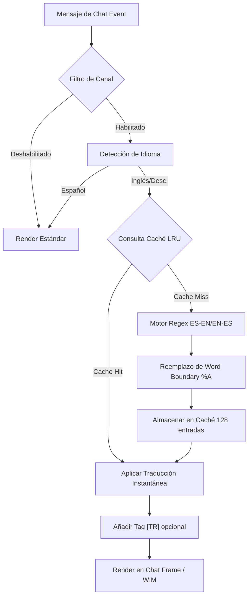

# 🏰 Wiki: Arquitectura 'Diamond Tier' — pfUI [v5.1.4]

Estructura modular del ecosistema **El Séquito del Terror** mantenido por **DarckRovert**.

## 🌐 Jerarquía de Carga (Boot Sequence)

El AddOn inicia mediante `modules.xml` con los siguientes puntos críticos de inyección:

1.  **Lexical Engine (`translator_dict.lua`)**: Carga los diccionarios indexados por longitud (ES-EN / EN-ES) para optimización de búsqueda (**Greedy Matching**).
2.  **Core Translator (`translator.lua`)**: Inyecciones en `ChatEdit_SendText` y `AddMessage` de los ChatFrames.
3.  **WIM Bridge**: Hook asíncrono sobre `WIM_PostMessage` para susurros.
4.  **GUI Integration (`gui.lua`)**: Registro de pestañas de configuración nativas de pfUI.

## 📊 Diagrama de Flujo: Traductor Universal v1.0.0

## 🔐 Diseño de Seguridad y Optimización

### Protección de Enlaces y Símbolos
El motor utiliza un sistema de **Regex Matching** para detectar patrones `|cff...|H...|h...|h|r` antes del proceso de traducción. Los enlaces se encapsulan en tokens temporales para preservar su integridad y permitir que sigan funcionando en el chat traducido.

### Control de Dirección Bidireccional
La versión **Omni-Tier** introduce el soporte para forzar la dirección de salida:
- **Auto-Detección**: Fallback inteligente.
- **ES -> EN**: Prioridad de exportación técnica.
- **EN -> ES**: Prioridad de localización local.

---
© 2026 **DarckRovert** — El Séquito del Terror.
*Soberanía Técnica Omni-Tier Consolidada.*
