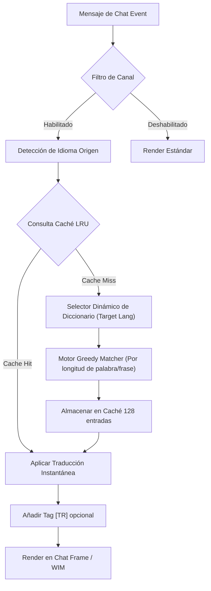

# 🏰 Wiki: Arquitectura 'Diamond Tier' — pfUI [v5.1.4]

Estructura modular del ecosistema **El Séquito del Terror** mantenido por **DarckRovert**.

## 🌐 Jerarquía de Carga (Boot Sequence)

El AddOn inicia mediante `modules.xml` con los siguientes puntos críticos de inyección:

1.  **Lexical Engine (`translator_dict.lua`)**: Carga y estructura en memoria los diccionarios globales indexados por longitud (`esES`, `enUS`, `ruRU`, `zhCN`) y genera automáticamente las tablas inversas para optimización de búsqueda (**Greedy Matching**).
2.  **Core Translator (`translator.lua`)**: Interceptores sobre `ChatEdit_SendText` para mensajes salientes y `AddMessage` para los ChatFrames entrantes, enrutando dinámicamente según la configuración de destino.
3.  **WIM Bridge**: Hook asíncrono sobre `WIM_PostMessage` para susurros.
4.  **GUI Integration (`gui.lua`)**: Registro del selector de idiomas y canales en las pestañas de configuración nativas de pfUI.

## 📊 Diagrama de Flujo: Traductor Multilingüe v1.1.0

## 🔐 Diseño de Seguridad y Optimización

### Protección de Enlaces y Símbolos
El motor utiliza un sistema de **Regex Matching** para detectar patrones `|cff...|H...|h...|h|r` antes del proceso de traducción. Los enlaces se encapsulan en tokens temporales para preservar su integridad y permitir que sigan funcionando en el chat traducido.

### Enrutamiento de Idioma Destino (Target Routing)
La versión **Omni-Tier v1.1.0** introduce el enrutamiento absoluto basado en la variable de entorno `C.translator.target_lang`:
- **Español (`esES`)**: Tabla principal y de inversión automática hacia el español.
- **Inglés (`enUS`)**: Normalización hacia inglés global.
- **Ruso (`ruRU`) & Chino (`zhCN`)**: Conversión y mapeo de glifos cirílicos o caracteres asiáticos con total soporte en el motor de renderizado.

---
© 2026 **DarckRovert** — El Séquito del Terror.
*Soberanía Técnica Omni-Tier Consolidada.*
