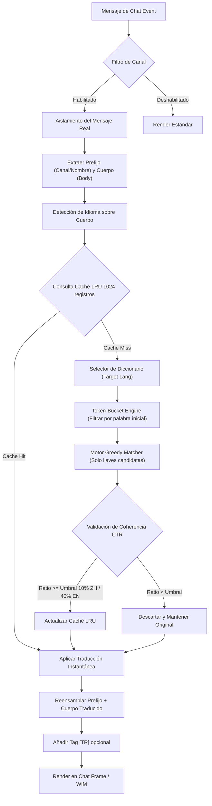

# 🏰 Wiki: Arquitectura 'Ultimate Tier' — pfUI [v5.1.4] (Translator v6.8.0)

Estructura modular del ecosistema **El Séquito del Terror** mantenido por **DarckRovert**.

---

## 🌐 Jerarquía de Carga (Boot Sequence)

El AddOn inicia mediante `init/modules.xml` con los siguientes puntos críticos de inyección:

1.  **Lexical Engine (`translator_dict.lua`)**: Carga y estructura en memoria 200 categorías del diccionario general con más de 5000 entradas trilingües de datos indexados por longitud (`esES`, `enUS`, `zhCN`), generando automáticamente tablas inversas optimizadas para búsquedas rápidas y utilizando una estructura estática reutilizable para un consumo de memoria mínimo (GC friendly).
2.  **Colosal Database (`translator_dict_db.lua`)**: Inyecta una base de datos colosal comprimida de misiones, hechizos de clase, profesiones, talentos, PvP y consumibles de WoW y Turtle WoW a través de un cargador en lote por strings crudos delimitados por `"|"`, re-ordenando y re-indexando los buckets dinámicamente.
3.  **Core Translator (`translator.lua`)**: Interceptores sobre `ChatEdit_SendText` para salientes y `AddMessage` para entrantes. Implementa el **Motor Token-Bucket** para un matching Greedy de complejidad $O(K)$ acotada y **Aislamiento Sintáctico** para proteger canales y enlaces.
4.  **WIM Bridge**: Hook asíncrono sobre `WIM_PostMessage` para susurros de jugadores.
5.  **GUI Integration (`gui.lua`)**: Registro del selector de idiomas, canales y depuración en las pestañas nativas de pfUI.

---

## 📊 Diagrama de Flujo: Traductor Multilingüe v6.8.0

---

## 🔐 Diseño de Seguridad y Optimización

### 1. Motor Token-Bucket (Prefix-Indexed candidate filtering)
Para evitar el lag severo en el hilo principal del chat clásico de WoW, el motor v6.8.0 descarta la iteración lineal de miles de llaves en cada mensaje recibido. Las frases del diccionario se estructuran al cargar en *buckets* según su palabra inicial (occidental) o carácter inicial (chino). En runtime, el motor tokeniza el mensaje de entrada y recopila únicamente las llaves candidatas asociadas a las palabras activas en la frase. Esto disminuye la búsqueda lineal secuencial a una fracción reducida y acotada, logrando traducción instantánea en microsegundos (<0.1ms).

### 2. Base de Datos Ampliada e Indexación Dinámica
El módulo `translator_dict_db.lua` inyecta 10 lotes temáticos (A hasta J) en lotes delimitados. Tras la inyección, el sistema re-ordena dinámicamente las claves por longitud (`strlen`) y reconstruye los buckets indexados de prefijos para los pares de idiomas correspondientes.

### 3. Aislamiento de Metadatos y Enlaces
El motor utiliza un sistema doble:
1.  **Aislamiento Sintáctico**: Evita procesar la línea completa del chat. Encuentra el enlace del jugador (`|Hplayer:...`) y el delimitador `: ` para separar los canales y el nombre de la conversación propiamente dicha.
2.  **Encapsulado de Enlaces**: Un sistema regex detecta patrones `|H.-|h.-|h` y los reemplaza temporalmente con tokens protegidos `\127L[ID]\127` antes de traducir, garantizando que sigan siendo cliqueables e interactivos al finalizar el reensamblaje.

### 4. Filtro de Ratio de Coherencia de Traducción (CTR)
El motor Ultimate-Tier implementa un validador de calidad:
*   **Chino (ZH)**: Analiza el conteo de bytes CJK multibyte. A partir de la v4.2.3 el CTR se relajó al **10%**, operando en un modo *best effort* agresivo que entrega traducciones híbridas para maximizar la cantidad de texto decodificado.
*   **Occidental (EN/ES)**: Analiza la proporción de cambio en palabras alfanuméricas. Si no cubre al menos el **40%**, se descarta para evitar "Spanglish".

---
© 2026 **DarckRovert** — El Séquito del Terror.
*Soberanía Técnica Ultimate-Tier Consolidada.*
