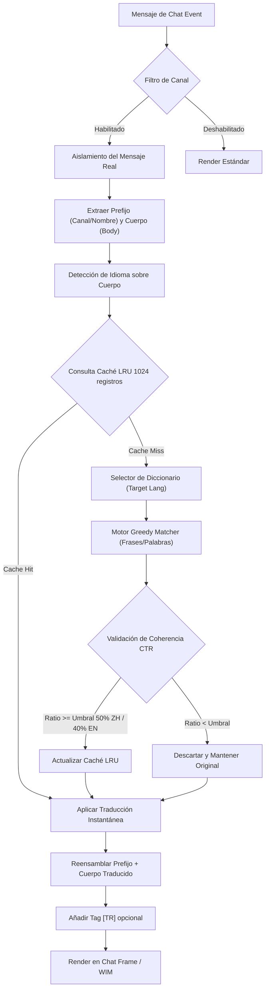

# 🏰 Wiki: Arquitectura 'Diamond Tier' — pfUI [v5.1.4]

Estructura modular del ecosistema **El Séquito del Terror** mantenido por **DarckRovert**.

## 🌐 Jerarquía de Carga (Boot Sequence)

El AddOn inicia mediante `modules.xml` con los siguientes puntos críticos de inyección:

1.  **Lexical Engine (`translator_dict.lua`)**: Carga y estructura en memoria 130 categorías del diccionario global con más de 3600 líneas de datos indexados por longitud (`esES`, `enUS`, `zhCN`), generando automáticamente tablas inversas optimizadas para búsquedas rápidas.
2.  **Core Translator (`translator.lua`)**: Interceptores sobre `ChatEdit_SendText` para salientes y `AddMessage` para entrantes. Extrae dinámicamente el cuerpo del mensaje de chat mediante **Aislamiento Sintáctico**, traduciendo únicamente esa porción para resguardar canales, colores y nombres.
3.  **WIM Bridge**: Hook asíncrono sobre `WIM_PostMessage` para susurros de jugadores.
4.  **GUI Integration (`gui.lua`)**: Registro del selector de idiomas, canales y depuración en las pestañas nativas de pfUI.

## 📊 Diagrama de Flujo: Traductor Multilingüe v4.2.0

## 🔐 Diseño de Seguridad y Optimización

### Aislamiento de Metadatos y Enlaces
El motor utiliza un sistema doble:
1. **Aislamiento Sintáctico**: Evita procesar la línea completa del chat. Encuentra el enlace del jugador (`|Hplayer:...`) y el delimitador `: ` para separar los canales y el nombre de la conversación propiamente dicha.
2. **Encapsulado de Enlaces**: Un sistema regex detecta patrones `|H.-|h.-|h` y los reemplaza temporalmente con tokens protegidos `\127L[ID]\127` antes de traducir, garantizando que sigan siendo cliqueables e interactivos al finalizar el reensamblaje.

### Filtro de Ratio de Coherencia de Traducción (CTR)
El motor Diamond Tier implementa un validador de calidad:
- **Chino (ZH)**: Analiza el conteo de bytes CJK multibyte. Si la traducción no abarca al menos el **50%** de los caracteres chinos, se descarta para evitar híbridos ("Chinol").
- **Occidental (EN/ES)**: Analiza la proporción de cambio en palabras alfanuméricas. Si no cubre al menos el **40%**, se descarta para evitar "Spanglish".

---
© 2026 **DarckRovert** — El Séquito del Terror.
*Soberanía Técnica Diamond-Tier Consolidada.*
